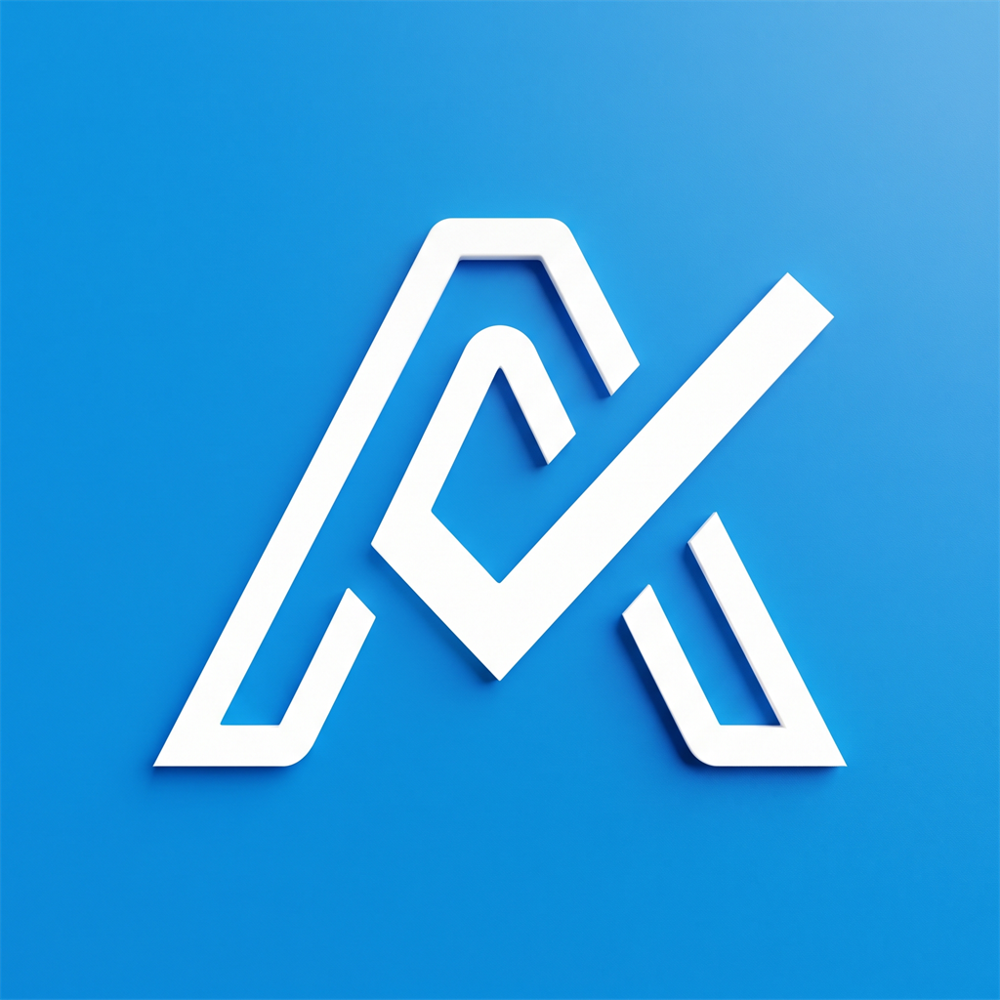

# 📱 Apkify — Расписание занятий нового поколения для iOS

<p align="center">
  
</p>

<p align="center">
  <b>Современное, быстрое и красивое мобильное приложение для студентов и преподавателей Альметьевского профессионального колледжа (АПК).</b><br>
  Разработано на новейшем стеке <b>Expo SDK 57</b>, <b>React Native 0.86</b> и <b>TypeScript</b> в соответствии с гайдлайнами <b>Apple Human Interface Guidelines (iOS HIG)</b>.
</p>

<p align="center">
  
  
  
  
  
</p>

---

## 📖 О проекте

Официальный веб-сайт расписания (`it-institut.ru`) часто медленно открывается в аудиториях с нестабильным мобильным интернетом, не оптимизирован под экраны смартфонов и планшетов и не предоставляет функции отслеживания текущих занятий в реальном времени.

**Apkify** решает эти проблемы кардинально:

- 🚀 **Прямой нативный сетевой стек iOS**: запросы выполняются напрямую к серверу колледжа, минуя тяжелые страницы браузера и ограничения CORS.
- ⚡ **Мгновенный парсинг**: собственный легковесный парсер на базе `node-html-parser` и движка **Hermes** мгновенно извлекает структурированные данные пар.
- 📶 **100% Офлайн-доступ**: сохранённое расписание мгновенно доступно даже в подвальных аудиториях без связи благодаря интеллектуальному кэшированию в `AsyncStorage`.
- 💎 **Дизайн Apple Human Interface Guidelines**: аутентичные шрифты San Francisco, размытия `BlurView`, squircle-скругления радиусов и эстетика **Liquid Glass**.

---

## ✨ Ключевые возможности

### 🕒 Умный трекер занятий и перемен в реальном времени

- **Автоопределение текущей пары**: живой индикатор с обратным отсчетом времени (_«Идёт • ост. 24 мин»_) и анимированным прогресс-баром.
- **Отслеживание перемен**: показ времени до следующего занятия и длительности перемены (включая большую 25-минутную перемену на обед).
- **Оповещение о начале дня**: если первой пары нет, приложение заботливо подсказывает: _«Первой пары нет — ко 2-й паре (к 09:30)»_.

### ⚡ Особое расписание звонков по субботам

- По субботам колледж учится по специальному графику (пары по 60 минут, 5-15 минут перемены).
- Встроенная компактная плашка субботнего режима с быстрым переходом к полной таблице звонков субботы.

### 👥 Интеллектуальное отображение подгрупп

- Все предметы с подгруппами отображаются прямо в основном потоке расписания.
- Чёткие цветные бейджи `1-я подгруппа` и `2-я подгруппа` с указанием преподавателя и кабинета для каждого занятия.

### 📤 Экспорт расписания на день в один тап

- Кнопка системного шеринга на карточке дня генерирует красивое форматированное текстовое расписание для отправки в Telegram, ВКонтакте, WhatsApp или Заметки.

### 🎨 5 тем оформления и 6 системных акцентов

- ☀️ **Светлая**: Apple Grouped Light (`#F2F2F7` фон, `#FFFFFF` карточки).
- 🌙 **Серая (Графит)**: сбалансированный серый оттенок Apple Slate (`#1C1C1E`).
- 🌌 **Тёмная (Угольная)**: глубокий ночной интерфейс (`#121214`).
- 🖤 **OLED (True Black)**: абсолютно чёрный фон `#000000` для максимальной экономии батареи на Super Retina дисплеях.
- ⚙️ **Авто**: мгновенное следование системной теме iOS.
- **6 акцентных цветов**: Синий, Фиолетовый, Изумрудный, Оранжевый, Розовый, Бирюзовый.

### 📐 Адаптивный интерфейс под iPhone и iPad (HIG Layout)

- Ограничение максимальной ширины контента (`maxWidth: 680-720pt`) с центрированием — интерфейс выглядит опрятно на любом экране от **iPhone SE** до **iPad Pro 13"**.
- Полноценная поддержка iPad Split View, Slide Over и альбомной ориентации (Landscape).
- Защита всех кнопок и бейджей от обрезания и вылезания текста (`adjustsFontSizeToFit`, `numberOfLines={1}`).

### 🛠️ Скрытый инженерный комплекс (Debug Menu)

- Открывается по секретному жесту: **7 быстрых тапов по номеру версии** внизу экрана настроек.
- **Time Travel (Машина времени)**: проверка отображения пар и звонков в любой день недели и час.
- **Интерактивное тестирование (Self-Test)**: живая самодиагностика сети, формулы недель, парсера, подгрупп, субботнего графика звонков и хранилища.

---

## 🆕 Что нового в версии V1.B4

1. **Новая официальная 3D-иконка приложения**:
    - Стильная объёмная белая геометрия символа «А» с акцентной галочкой на насыщенном лазурном фоне (`#0F94DF`).
    - Идеально соответствует требованиям Apple Human Interface Guidelines: строгий квадрат 1024×1024, безопасная зона 66%, отсутствие фальшивых пред-скруглений.
2. **Бесшовный экран загрузки (Splash Screen)**:
    - Мягкий радиальный переход фирменного градиента без стыков и швов при старте приложения на любом устройстве.
3. **Обновление Android Adaptive Icon и Favicon**:
    - Перекалиброваны слои Foreground и Background, обновлена иконка для веб-версии.
4. **Все улучшения линейки v1.B**:
    - Переименование экрана в «Настройки» с системной шестерёнкой;
    - Скрытие Debug Menu (доступно по 7 тапам на версию внизу);
    - Адаптация под iPad, iPad Split View и альбомную ориентацию;
    - Защита кнопок от вылезания текста (`adjustsFontSizeToFit`, `numberOfLines={1}`);
    - Компактная кнопка шеринга и темы оформления OLED True Black, Slate Gray, Light.

---

## 📥 Установка приложения

### Вариант 1: Установка готового IPA (Рекомендуется)

Готовые сборки формируются через GitHub Actions и публикуются в [Releases](https://github.com/DRAKKOSHKKA/apkify/releases):

1. Скачайте `Apkify.ipa` из последнего [Релиза v1.B4](https://github.com/DRAKKOSHKKA/apkify/releases).
2. Установите на iPhone или iPad с помощью:
    - **Sideloadly** (Windows / macOS) — подключите телефон по USB, перетащите IPA и введите Apple ID;
    - **AltStore** или **SideStore**;
    - **TrollStore** (для поддерживаемых версий iOS).

> [!NOTE]
> Сборка из GitHub Actions полностью очищена от предварительных ad-hoc подписей, поэтому Sideloadly и AltStore безупречно переподписывают все встроенные бинарные фреймворки (ExpoModulesJSI, React, Hermes) без сбоев при запуске.

### Вариант 2: Запуск через Expo Go (Для разработки)

1. Установите **Node.js 22 LTS** и **Git**.
2. Клонируйте репозиторий:
    ```bash
    git clone https://github.com/DRAKKOSHKKA/apkify.git
    cd apkify
    npm install
    ```
3. Запустите проект:
    ```bash
    npm start
    ```
    Или запустите файл `start-expo-go.bat` на Windows.
4. Отсканируйте QR-код приложением **Expo Go** на iOS или Android.

---

## 🏗️ Структура проекта

```text
v:/Apkify/
├── .github/workflows/
│   └── build-ipa.yml            # CI/CD автоматической сборки неподписанного IPA на macOS
├── docs/
│   └── IOS_BUILD_GUIDE.md       # Подробная инструкция по сборке и установке IPA
├── assets/                      # Иконка приложения, адаптивные splash-экраны
├── src/
│   ├── constants/
│   │   └── appInfo.ts           # Единый конфигурационный файл версии (V1.B3) и API
│   ├── theme/
│   │   ├── tokens.ts            # Токены Apple HIG (радиусы, отступы, тени)
│   │   └── colors.ts            # 5 тем (Light, Slate, Dark, OLED) и 6 акцентов
│   ├── types/
│   │   └── schedule.ts          # Модели TypeScript расписания и сущностей
│   ├── services/
│   │   ├── api.ts               # Загрузка и парсинг расписания с it-institut.ru
│   │   └── storage.ts           # Персистентное хранилище настроек и кэша
│   ├── utils/
│   │   └── timeUtils.ts         # Расчёт времени пар, звонков и субботнего графика
│   ├── components/
│   │   ├── Header.tsx           # Шапка с выбором недели и группы
│   │   ├── DaySelector.tsx      # Селектор дней недели
│   │   ├── LessonCard.tsx       # Карточка пары с бейджами и индикатором
│   │   ├── TabBar.tsx           # Адаптивный таб-бар (Расписание / Настройки)
│   │   ├── DebugModal.tsx       # Инспектор системы и комплекс тестов
│   │   ├── SearchModal.tsx      # Поиск групп, преподавателей и кабинетов
│   │   ├── CallsScheduleModal.tsx # Таблица звонков (Будни / Суббота)
│   │   └── WeekModal.tsx        # Селектор учебных недель
│   └── screens/
│       ├── ScheduleScreen.tsx   # Главный экран расписания
│       └── ProfileScreen.tsx    # Экран настроек приложения
├── App.tsx                      # Корневой компонент
├── app.json                     # Конфигурация Expo
└── package.json                 # Зависимости и скрипты
```

---

## 🛠️ Сборка IPA в облаке (GitHub Actions)

В проекте настроена автоматическая компиляция на виртуальных машинах macOS (`macos-15` на Apple Silicon) с установленным Xcode 16:

- Компиляция React Native кода в нативный Objective-C / Swift бинарник через `xcodebuild`;
- Полная упаковка в `.ipa` Payload;
- Автоматическая публикация готового IPA в **GitHub Releases**.

Запуск выполняется через вкладку **Actions** репозитория или через GitHub CLI:

```bash
gh workflow run "Build iOS IPA (Free CI)" -f create_release=true -f tag_name="v1.B3"
```

---

## 📄 Лицензия

Проект разработан для студентов и преподавателей Альметьевского профессионального колледжа.
Распространяется свободно в образовательных целях.
